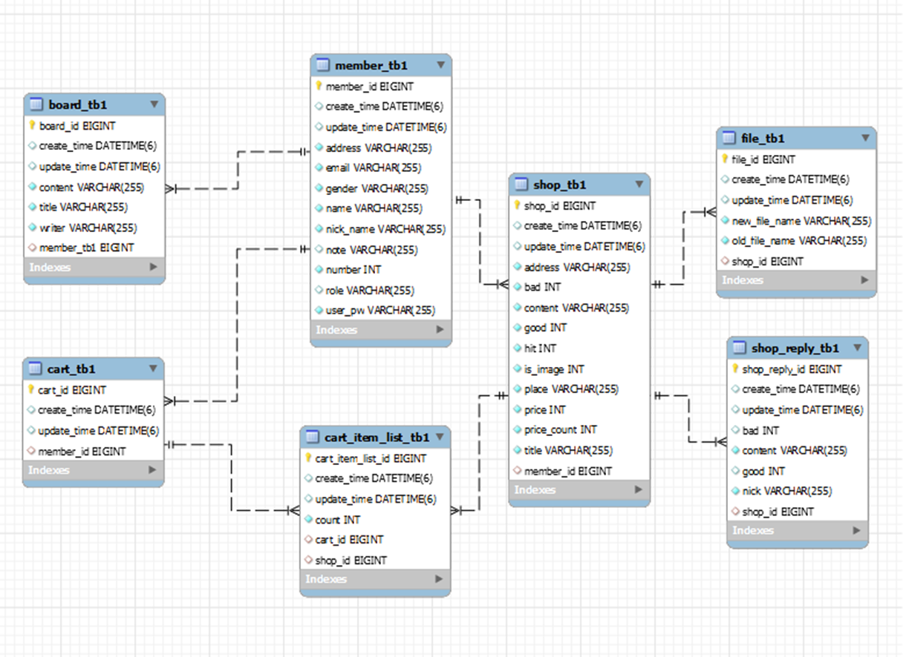

 

<h2 align="center" style="color:#96b3d9"> 쇼핑몰& 관리자 모드 기반 챗봇 구현 </h2>

 

## 📕프로젝트 소개

- 관광상품을 판매하는 사이트
- 판매자와 구매자를 나누어서 판매자는 판매가 가능하고 구매자는 구경 및 장바구니 담기가 가능

| 작업파일                                                                                                                |
|---------------------------------------------------------------------------------------------------------------------|
| [쇼핑몰& 관리자 모드 기반 챗봇 구현](https://github.com/Jmgjava/team_project1/tree/master/shoppingMall_project) |

 

## 💻사용프로그램

 
 

 

 

 

 

 

 

 

 

  

 

## 📁ERD

 

## 🙍‍♂️팀원
|이름| 작업 |
|--|----|
|조민근| OAuth2, DB설계, kakaoMap api, CICD, 인기순위|
|정**|reply, 프론트, Q&A 프론트|
|왕**|Member(회원) CRUD|
|박**|Board(상품)  CRUD, ( 장바구니 ) CRUD|
|서**|shopList, ADMIN 창( Member, Board 창 삭제,수정)|

 

## ✍작업내용

- [**DB설계**](#DB-설계)
    - 데이터베이스설계
- [**Oauth2, 로그인**](#Oauth2-로그인)
    - 아이디 비번 및 kakao, google, naver 로그인
    - 로그인 성공 및 실패시 event
- [**kakaoMap API**](#kakaoMap-API)
    - Daum 주소 API 활용
    - 카카오 지도 및 marker 구현
- [**인기순위**](#인기순위)
    - 관광상품 조회수를 기준으로 순위구현

 

### DB 설계

- **회원(구매자, 판매자)** 은 **여러개의 상품** 을 **장바구니**에 담음
- **회원(구매자, 판매자)** 은 **여러개의 댓글**을 작성할 수 있음
- **회원(판매자)** 은 **여러 개의 상품** 을 올릴 수 있음

### Oauth2, 로그인

- 로그인 성공 시 성공메세지 화면에 표시
- 로그인 실패 시 예외처리 후 html 로 표현
- oauth2 로 소셜 로그인 구현

| 로그인 실패 시                                                                                               |
|--------------------------------------------------------------------------------------------------------|
|  |

| 로그인 성공 시                                                                                                  |
|-----------------------------------------------------------------------------------------------------------|
|  |

| google, naver, kakao 로그인                                                                                 |
|----------------------------------------------------------------------------------------------------------|
|  |

### kakaoMap API

- Daum 주소 API 사용해 주소창 입력
- 입력한 주소 kakaoMap 으로 위도, 경도 찾아 마커 구현

| **Daum 주소 API** 활용해 주소창을 입력  |
|------------------------------|
|  |

| kakaoMap API 사용                                                                                            |
|------------------------------------------------------------------------------------------------------------|
|  |

### 인기순위

- 상품의 조회수순으로 순위를 만들어 등수를 매김

| top3 인기순위                                                                                            |
|------------------------------------------------------------------------------------------------------|
|  |

| 클릭시 선택한 등수 페이지로 이동                                                                                       |
  |---------------------------------------------------------------------------------------------------------------|
|  |

 

